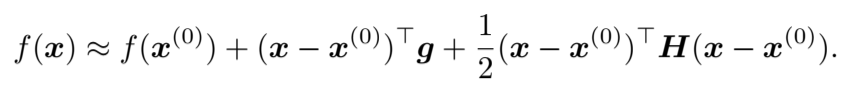
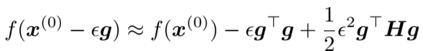
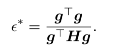
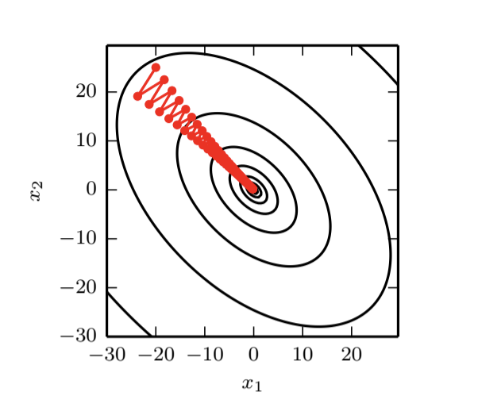
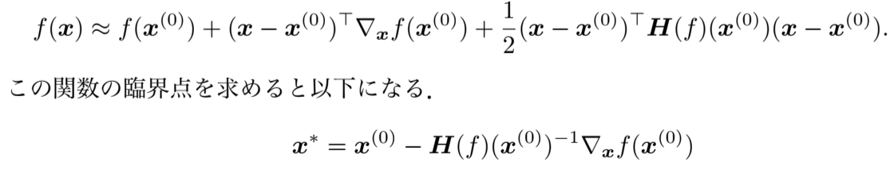

# Deep Learning 第四章の要約
## 概要
 これは[Deep Learning(Goodfellow)](http://www.deeplearningbook.org/)の第四章の要約である.
 
## 要約
### ■4.1 オーバーフローとアンダーフロー
- オーバーフロー  
 無限大をNaNとか9999999999にしちゃうことで発生するバグや誤差.
- アンダーフロー  
 0.000000001とかを0にしちゃうことで発生する誤差.
 
 
### ■4.2 悪条件
- 条件数(condition number)  
  コンピュータの計算において数値解析のしやすさを表したもので, 値が小さければ良条件で大きければ悪条件.
  
- 定義  
  
ただし`λ`は`A`の固有値  

- 導出  
　  
を解きたいとし, この場合`b`の変化によって解である`x`が変化する率が条件数となる.  
`b`の誤差を`e`をすると解に現れる誤差は,  
　  
となる. 解の相対誤差と`b`の相対誤差の比率は  
　  
これは次のように書き変えられる.  
　  
その最大値は2つの作用素ノルムの積となる.  
　  
当然, 行列ノルムの選択に依存しており, l2ノルムなら  
　  
となる.  

### 4.3 勾配に基づく最適化
- 目的  
あたえられた関数f(x)の最小値を見つける.  

- 用語  

|用語|英語|説明|
|:--|:--|:--|
|最大値|global maximum|関数全体で最も大きな値|
|最小値|global minimum|関数全体で最も小さな値|
|極大値|local maximum|近傍で最も大きな値|
|極小値|local minimum|近傍で最も小さな値|
|臨界点|critical points|f'=0となる点|
|停留点|stationary points|同上|
|鞍点|saddle points|臨界点であるが極大値でも極小値でもない点|

- 勾配降下法  
`x′ = x − ε∇xf(x)`  
で新しい点を更新し続ける.  
εは学習率と呼ばれ, 正のスカラー値.  
値の決め方はいくつかあり,  
 - 小さい値にする
 - いくつかのεに対して計算し, 最も良かった値を採用する
などである.

### ■ 4.3.1 勾配を超えて : ヤコビ行列とヘッセ行列
- ヤコビ行列  
 に対して偏微分全てを要素として持つ行列をヤコビ行列という.
  
    
  
- ヘッセ行列
 同様に二回微分を要素として持つ行列をヘッセ行列という.
 
 
 
 なので
 
となりヘッセ行列は対称行列となる.

参考 : [Wikipedia](https://ja.wikipedia.org/wiki/%E6%9D%A1%E4%BB%B6%E6%95%B0)  

- 関数への応用
#### 復習
f'(x)>0ならfはxで増加してる
f'(x)<0ならfはxで減少している

#### テイラー展開
これらを用いて, テイラー展開は次のように書ける.

x(0)におけるヤコビ行列が**g**で, ヘッセ行列が**H**である.  
点x(0)から学習したあとの新しい点をxをすると  
x = x(0) - εgとなるので  

となる.  
それぞれの項を説明すると,  
1つ目が関数の元の値  
2つ目が関数の傾きから予測される改善の値  
3つ目が関数の曲率から予測される補正値  

#### 学習率
ここで, εはどんな値がいいのか.  
この値が大きすぎるとテイラー級数近似が正確ではなくなってしまう.  
関数のテイラー級数近似を減少させる最適なステップ幅は次式で求めることができる.  

となる.  

**g**が**H**の最大固有値に対応する固有ベクトルと同じ方向である場合, 最適なステップ幅は1/(最大固有値)となる.  
このようにヘッセ行列の固有値で学習率の大きさを決定することができる.  

#### 極値判定法
f'=0かつf''>0ならば極小  
f'=0かつf''<0ならば極大  
残念ながらf''=0の場合はこの手法では判定できない. 鞍点かもしれないし,ただの平坦な領域の一部かもしれない.  

#### 多次元への応用
grad(f)=0となる臨界点ではヘッセ行列の固有値を調べつことで極小か, 極大か, 鞍点かを判別できる.  
ヘッセ行列が正定値の場合, 極小.  
ヘッセ行列が負定値の場合, 極大.  
多次元の場合は鞍点でである明確な根拠を見つけることが可能で,  
少なくとも1つの固有値が正で, 少なくとも1つの固有値が負なら, 鞍点.  
>memo
>全ての固有値が正である行列のことを"正定値"という.
>その逆を"負定値"という.

もし, 普通の勾配降下法で最適化しようとすると,

のように無駄な動きが出てしまう.  
これは微分の情報しか与えれていないため, 傾きが大きいすぎる方向があれば底を通り過ぎてしまう.  

#### ニュートン法
ヘッセ行列の情報を探索に使用することで解決できる.  

